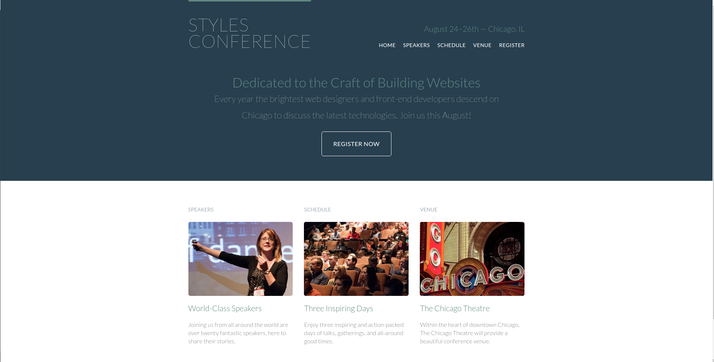

# Shay_Howe-Styles_conference

> I read through Learn to Code HTML and CSS by Shay Howe.

> 

It is a hands-on book to learn through building which lead to the creation of a website "Styles Conference".

## Built With

- HTML & CSS
- None
- VS Code

## Live Demo

[Live Demo Link](https://raovikrant82.github.io/Shay_Howe-Styles_conference/)

## Authors

👤 **Author**

- GitHub: [@raovikrant82](https://github.com/raovikrant82)
- Twitter: [@Imvikrantrao](https://twitter.com/Imvikrantrao)

## 🤝 Contributing

Contributions, issues, and feature requests are welcome!

Feel free to check the [issues page](../../issues/).

## Show your support

Give a ⭐️ if you like this project!

## Acknowledgments

- Hat tip to Scrimba for such a wonderful tutorial
- Inspiration
- etc

## 📝 License

This project is [MIT](./MIT.md) licensed.
